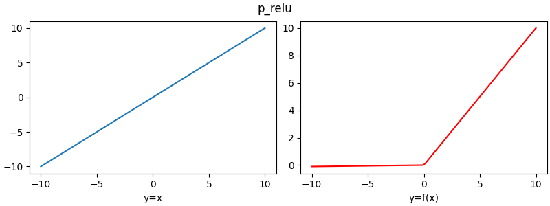
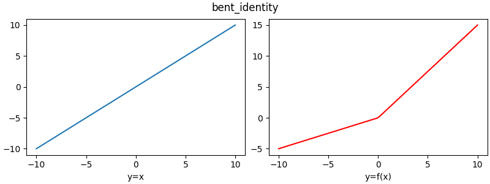

# Neural Networks - Activation Function Analysis

A neural network modelling requires an extensive use of activation functions and the correct activation function can help control and model the output of the problem statement.

This repository has a wide collection of various acivation functions and their python implementations in the script  `activation_functions.py`.
To install the requirements:

```
$ pip install -r requirements.txt
```
The activation functions covered here are:
- Linear
- Tanh
- Sigmoid
- ReLU
- Leaky ReLU
- PReLU
- Softplus
- Binary Step
- Swish
- Elu
- SiLU
- Mish
- Bent Identity
- Gelu
- Arctan
- Le Cun's Tanh
- Biplar Sigmoid
- Logit

This list is non exhaustive.

This repository also contains a script called `create_function_plots.py` which creates plots for each and every activation function. The plots are saved in the `plots` directory in the <*activation*>.png format.

```
$ python create_function_plots.py

```

<details>
  <summary><b>A few visualizations of the plots of the activation functions are shown below:</b></summary><br>
  
  <summary align = "center"><b>Sigmoid ⬇️</b></summary><br>
  <p align="center"></p>
  
  <summary align = "center"><b>Relu ⬇️</b></summary><br>
  <p align="center"></p>
  
  <summary align = "center"><b>Binary Step ⬇️</b></summary><br>
  <p align="center"></p>
  
  <summary align = "center"><b>linear ⬇️</b></summary><br>
  <p align="center"></p>
  
  <summary align = "center"><b>tanh ⬇️</b></summary><br>
  <p align="center"></p>
  
  <summary align = "center"><b>leaky_relu ⬇️</b></summary><br>
  <p align="center"></p>
  
  <summary align = "center"><b>p_relu ⬇️</b></summary><br>
  <p align="center"></p>
  
  <summary align = "center"><b>softplus ⬇️</b></summary><br>
  <p align="center"></p>
    
  <summary align = "center"><b>swish ⬇️</b></summary><br>
  <p align="center"></p>
   
  <summary align = "center"><b>elu ⬇️</b></summary><br>
  <p align="center"></p>
  
  <summary align = "center"><b>silu ⬇️</b></summary><br>
  <p align="center"></p>
   
  <summary align = "center"><b>Binary Step ⬇️</b></summary><br>
  <p align="center"></p>
   
  <summary align = "center"><b>Binary Step ⬇️</b></summary><br>
  <p align="center"></p>
   
  <summary align = "center"><b>mish ⬇️</b></summary><br>
  <p align="center"></p>
   
  <summary align = "center"><b>bent_identity ⬇️</b></summary><br>
  <p align="center"></p>
   
  <summary align = "center"><b>gelu ⬇️</b></summary><br>
  <p align="center"></p>
   
  <summary align = "center"><b>arctan ⬇️</b></summary><br>
  <p align="center"></p>
   
  <summary align = "center"><b>lecuns_tanh ⬇️</b></summary><br>
  <p align="center"></p>
   
  <summary align = "center"><b>lbipolar_sigmoid ⬇️</b></summary><br>
  <p align="center"></p>
   
  <summary align = "center"><b>logit ⬇️</b></summary><br>
  <p align="center"></p>
  
</details>


